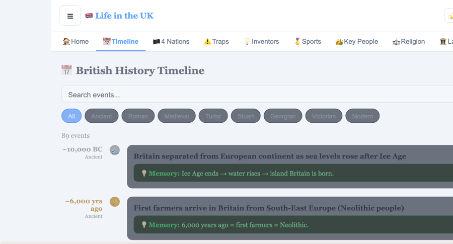
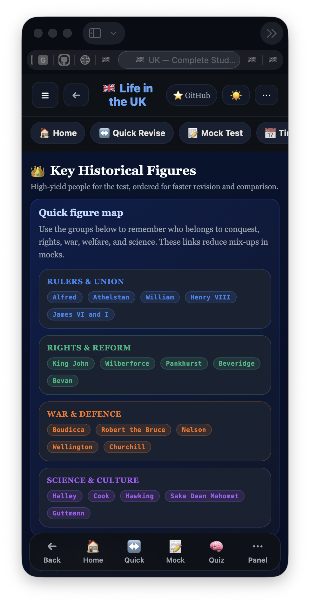
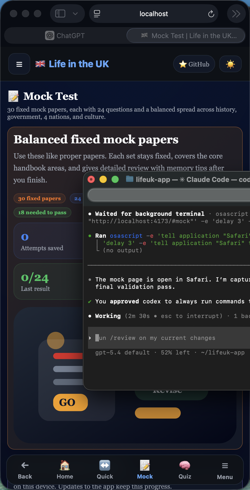

# 🇬🇧 Life in the UK Test Practice for ILR and Citizenship

A free, mobile-friendly study guide and practice app for the **Life in the UK test**, built for **British citizenship** and **Indefinite Leave to Remain (ILR)** preparation.

> 📖 324 quiz questions · 💡 Memory clues · ⚠️ Confusing topics together · 📅 Full timeline · 📝 Mock tests with saved progress

Current release: `v1.16.0`

---

## 🌐 Live Site

[**→ Open the Live Study Guide for ILR and Citizenship Prep**](https://kanwalnainsingh.github.io/KNS-Life-In-UK-Test/)

Official test info: https://www.gov.uk/life-in-the-uk-test

UI stack now uses:
- Tailwind CSS
- shadcn-style open-source UI primitives
- class-based dark mode with persisted preference
- calmer shared visual system across Home, Quick Revision, Quiz, Mock, Story, Timeline, 4 Nations, and Figures

---

## 🎯 Who This Is For

- People preparing for the Life in the UK test for `ILR`
- People applying for `British citizenship / naturalisation`
- Learners who want quick revision, mock tests, and memory clues instead of reading dense notes

---

## 📸 Screenshots

<p align="center">
  
  &nbsp;
  
  &nbsp;
  
  &nbsp;
  
</p>
<p align="center"><strong>Current mobile views</strong> — revision hub, history timeline, key figures, and the saved mock-paper tracker.</p>

---

## 📱 How to Use

1. Open the app at the live link above.
2. Use the top menu on desktop or the bottom navigation / quick panel on mobile.
3. Start with `Quick Revise` for fast facts and memory clues.
4. Use `Quiz` if you want normal practice with answer options:
   - show answers instantly
   - show answers at the end
   - include context and memory tips
5. Use `Mock Test` for a more exam-style run.
6. Use `Rapid Fire` for faster timed recall.
7. Use `Revise Mistakes` to retry weak questions.

---

## ✨ Features

| Section | What it does |
|---|---|
| 🏠 Home | Revision hub, coverage checklist, quick jump links, memory visuals |
| ↔️ Quick Revise | Fast card-by-card revision with topic filters, `Fresh mix`, `Pass core`, `Weak areas`, `Saved facts`, `Common traps`, `Dates`, and `4 Nations` focuses |
| 📚 Story Mode | Chronological chapter-by-chapter revision with explicit dates, names, and pass-first memory anchors for the main history and modern-Britain story |
| 🔟 Daily 10 | Fresh 10-question practice set for quick phone sessions, with wrong-answer review at the end |
| ⚡ T/F Sprint | Very fast true/false mobile revision |
| 📄 Cram Sheet | One-page night-before summary |
| ✅ Tracker | Full-course completion tracker stored on device |
| 📅 Timeline | Full history timeline with search, era filters, and anchor dates |
| 🏴 4 Nations | Capitals, saints, symbols, languages, parliaments, and common traps |
| ⚠️ Confusing Topics | Side-by-side comparisons for the facts people mix up most |
| ⚡ Quick Facts | Government, law, values, daily life, citizenship basics |
| 🏛️ Landmarks | Important places with memory clues and exam traps |
| ⛪ Religion | Faith groups and major festivals |
| 💡 Inventors | British inventors and key discoveries |
| 🏅 Sports | Sports stars and high-yield exam facts |
| 👑 Key People | Historic figures, grouped memory links, and revision cues |
| 🎭 Arts | Literature, music, art, architecture, fashion, and film |
| 🌍 World Orgs | Commonwealth, UN, NATO, Council of Europe, G7 |
| 🧠 Quiz | Practice mode with answer timing options and memory tips |
| 📝 Mock Test | 40 fixed balanced mock papers with saved per-paper scores, attempts, and next-paper guidance |
| 🔥 Rapid Fire | Timed revision with broader randomisation, fewer repeats, and a reset option when you want a fully fresh run |
| ♻️ Revise Mistakes | Retry the questions you got wrong |

---

## 🧠 What’s New

- Better mobile navigation with bottom nav, quick panel, back controls, and less scrolling
- Home now has a pass-focused learner layer on top of the existing modes:
  - `Start here` routes for new learners, test-soon learners, and mock-first learners
  - saved `7-day`, `3-day`, and `night-before` pass plans
  - `Next best action`, readiness score, and weakest-area guidance
- Bookmarks are now supported for:
  - quick-revision fact cards
  - quiz questions
  - mock questions
  - mistake-revision questions
- `Quick Revise` now includes a `Saved facts` focus so bookmarked facts can be reviewed quickly
- `Quick Revise` now shows answer, context, and memory clue immediately so it works as a true fast-scroll revision mode
- `Quick Revise` now has a broad topic filter so you can stay inside one subject like `History`, `Wars`, `Law`, `Landmarks`, `Key People`, `World Orgs`, or `Arts`
- `Quick Revise` keeps your place quietly in the background, while `Show all now` and `Reset progress` give you manual control when needed
- `Revise Mistakes` now also links into saved questions and weak-fact study
- Bottom mobile navigation now keeps the main study flow visible:
  - `Home`
  - `Revise`
  - `Quiz`
  - `Mock`
  - `Menu`
- The bottom nav now highlights the correct parent area when you are inside related study modes like `Story`, `Daily 10`, `Rapid Fire`, or `Revise Mistakes`
- Long mobile pages now include both `Top` and `End` floating scroll helpers
- UI migration to Tailwind CSS plus shadcn-style reusable primitives for cards, buttons, badges, progress, and sheets
- Class-based dark mode now initializes before render and respects system preference when no saved choice exists
- Stable `Story Mode` now uses dedicated chapter data instead of fragile runtime lookups
- Story Mode now reads as a clearer chronological course with stronger date anchors from Roman Britain to devolution and modern civic life
- Story Mode now surfaces exact `dates to remember`, `names to know`, and `pass-first notes` in every chapter so history revision is easier to lock in before a mock
- Home is now cleaner above the fold with a simpler pass path, quieter surfaces, and less repeated guidance competing for attention
- Longer topic pages now end with clear follow-up actions so `4 Nations`, `Quick Facts`, `Key People`, `Arts`, and `World Orgs` can lead straight into practice instead of feeling like dead-end reading screens
- Shared mobile density is now lighter too, with tighter card padding and more consistent long-page spacing across the heavier revision sections
- `Story Mode` chapter actions and the follow-up actions in `Religion`, `Landmarks`, `Inventors`, and `Sports` now open focused `Quick Revise` runs instead of generic reading dead ends
- Added a browser smoke test using `puppeteer-core` and Chrome to validate Home, Quick Revision, Story Mode handoff, Mock start, Rapid Fire, and follow-up actions after each build
- `Religion`, `Sports`, `Landmarks`, and `Inventors` are now more pass-first: each starts with `must know first` anchors before the longer reference list
- Lower-priority reference tabs were extracted into a dedicated module so future UI changes are safer and `src/app.jsx` is less overloaded
- The visual system is now cleaner and calmer in both light and dark mode, with softer surfaces, lighter mobile chrome, and stronger contrast discipline
- `Home`, `Quick Revision`, `Quiz`, and `Mock Test` now have a clearer hierarchy and less visual noise on both mobile and desktop
- More relevant grouped navigation with main actions first and topic subsections underneath
- `Quick Revise` has been redesigned around short return-friendly sessions:
  - `5 min`, `10 min`, and `15 min` runs
  - `Fresh mix`, `Pass core`, `Weak areas`, `Common traps`, `Dates`, and `4 Nations` focuses
  - session continuity across refreshes
  - `Hard / Okay / Easy` feedback so weaker facts can come back later
- `Daily 10` now ends with a proper review block for wrong answers:
  - your answer
  - correct answer
  - why it matters
  - memory clue
- `Rapid Fire` now explains its fresh-question behavior more clearly and includes `Reset progress` to clear recent-history avoidance when you want a completely new run
- `Mock Test` and `Revise Mistakes` modes
- Mock results now give a better next-step handoff:
  - weakest area
  - direct link to that weak topic
  - direct link to `Revise Mistakes`
  - trap review shortcut
- Answer reveal toggles for quiz and mock flows
- Mock paper history is now saved per paper with best score, attempts, and last score kept in local storage across app updates
- Visual mnemonic packs like `LECB`, `BSLH`, and `DRIM`
- Expanded `Key Historical Figures` into a stronger single-place revision page with:
  - fuller exam-focused fact sets
  - stronger date anchors
  - missing high-yield names like `Henry VII`, `Charles II`, `Sir Francis Drake`, `Isaac Newton`, `Alexander Fleming`, and `Sir Tim Berners-Lee`
  - especially fuller coverage for `Henry VIII`
- Improved timeline with extra high-yield history anchors:
  - Boudicca
  - St Augustine
  - Athelstan
  - Henry VIII and Wales
  - first Union Flag
  - Beveridge Report
  - Elizabeth II coronation
- Dedicated `Wars & Battles` section with battle cards, compare traps, and WWII anchors
- Added direct quiz coverage for `Boxing Day`, closing the last festival audit gap
- Added boundary-topic coverage for:
  - `British Isles`
  - `Republic of Ireland`
  - `Crown Dependencies`
  - `Channel Islands`
  - `British Overseas Territories`
- Added more direct high-yield question coverage for:
  - Welsh and Scottish Gaelic language facts
  - Holyrood and Stormont
  - EU citizens and local-election voting
  - census facts used across religion and society questions
- Added more high-yield civics and everyday-life coverage across revision, mocks, and rapid modes:
  - Model Parliament
  - Cabinet ministers
  - life peers and hereditary peers
  - Police and Crime Commissioners
  - jury-service eligibility
  - National Lottery age
  - blood donation timing
  - National Trust as a charity
  - post-war decolonisation / Empire winds down
- Added the missing official-scope `citizenship / settlement` context with stable GOV.UK-style facts and questions:
  - why people take the Life in the UK Test
  - language + life in the UK as the two-part knowledge requirement
  - English, Welsh, or Scottish Gaelic as accepted languages for that requirement
  - age-based exemptions and long-term-condition exemptions
- Added more compare-heavy exam coverage for underrepresented traps and modern facts:
  - `National Insurance` vs `council tax`
  - `Industrial Revolution` vs `Glorious Revolution`
  - `Jacobites` vs `Williamites`
  - `single-party government` vs `coalition government`
  - `Police and Crime Commissioner` vs `local councillor`
  - `Beveridge Report` vs `Butler Act`
  - `criminal courts` vs `civil courts`
  - `Cenotaph = empty tomb`
  - `Maiden Castle = Dorset`
- Strengthened the `4 Nations` section with cross-nation system facts:
  - England and Wales share one legal system
  - Scotland and Northern Ireland have separate legal systems
  - Scotland uses `Highers`
  - Northern Ireland requires photo ID at polling stations
- Added new handbook-style civics and culture questions and revision cues for:
  - civil servants
  - coalition government
  - school governors
  - local elections in May
  - offensive-weapon law
  - John Milton and Handel's `Messiah`
  - Tate Britain / Tate Modern
  - Turner Prize
  - rugby originating in England
- Fixed the old mock-answer bias by shuffling option order safely across quiz, mock, rapid fire, sprint, and mistake-revision sessions
- Expanded the revision layer so `Quick Revise`, `Cram Sheet`, and `Tracker` cover arts, sports-event anchors, symbols, and compare topics more evenly across the course
  - nation-specific court, church, and devolution compare points
- Expanded `Speaker of the House of Commons` coverage across the app:
  - how the Speaker is chosen
  - the Speaker's role in Commons debates
  - political neutrality
  - the fact that the Speaker still remains an MP
- Reordered weaker reference-heavy sections so the most important facts appear first:
  - `Quick Facts` now labels sections like `Must know first`, `Easy marks`, and `Good to know`
  - `Key People`, `Inventors`, `Arts`, `Landmarks`, and `World Orgs` now surface exam-core names and facts before the fuller reference list
  - broader facts are still included, but moved lower with clearer labels instead of competing with the highest-yield material
- Improved `Story Mode` as a guided revision flow:
  - remembers the last chapter you were on
  - shows `Most tested in this chapter` anchors
  - lets you mark chapters done
  - shows progress across all chapters
- Reworked the story chapters into a cleaner chronological arc:
  - Roman Britain and early England
  - conquest, medieval kings, Magna Carta, and Parliament
  - Tudors and Reformation
  - Stuarts, Civil War, Restoration, and Glorious Revolution
  - union, empire, reform, world wars, devolution, and modern Britain
- Tightened the `↻ Latest` refresh path:
  - refresh now forces a service-worker update check before unregistering old registrations
  - reload adds stronger cache-busting parameters so phones are more likely to fetch the newest bundle immediately
- Rebalanced the fixed mock papers to a more exam-like spread:
  - `7` history
  - `7` government and law
  - `5` 4 nations and places
  - `4` people and culture
  - `1` compare trap
- Increased fixed papers from `30` to `40`
- Added a dedicated mock-balance regression test so every paper stays at `24` questions with the intended coverage split
- Improved mock-paper variety across the full 40-paper series so working through them gives broader whole-course revision instead of reusing the same subset too often
- Offline cache support after first online load
- Local bundled build setup for GitHub Pages with fingerprinted assets in `docs/`

---

## 🛠️ Project Files

- `index.html` — page shell and shared CSS
- `docs/` — GitHub Pages build output
- `service-worker.js` — offline cache support
- `src/app.jsx` — React UI and study modes
- `src/main.jsx` — bundled app entry point
- `src/data.js` — facts, mnemonics, categories, and question bank
- `scripts/build.mjs` — static build for GitHub Pages
- `tests/smoke-check.cjs` — structure/content checks
- `tests/coverage-audit.cjs` — fact/question coverage audit
- `tests/regression-check.cjs` — duplicate-question and key-content regression checks
- `AGENTS.md` — notes for future contributors and coding agents

---

## ▶️ Run Locally

```bash
npm install
npm run build
npm test
npm run test:browser
python3 -m http.server 4173 -d docs
```

Then open `http://localhost:4173`

For GitHub Pages:
- build output is written to `docs/`
- the repo now includes `.github/workflows/pages.yml` for automatic Pages deployment on every push to `main`
- in GitHub repo settings, set Pages source to `GitHub Actions`

---

## 🚀 Release Versioning

- The visible app release version comes from `package.json`
- Bump `package.json` for each user-facing release
- The current version is shown in the app footer and on the home screen
- Users can tap `↻ Check Update` in the footer to force-refresh cached mobile pages
- Saved mock paper progress uses local storage, so attempts and scores stay available after new versions are deployed
- Timeline progress can be saved with a checkpoint so learners can jump back to the last remembered point
- Section pages now include more exam-anchor cards, memory clues, and compare points for faster revision
- Once the app has loaded online, the service worker can cache it for offline train revision

---

## 📚 Source

Based on **Life in the United Kingdom: A Guide for New Residents** and organised into faster revision formats with extra memory clues and comparisons.
