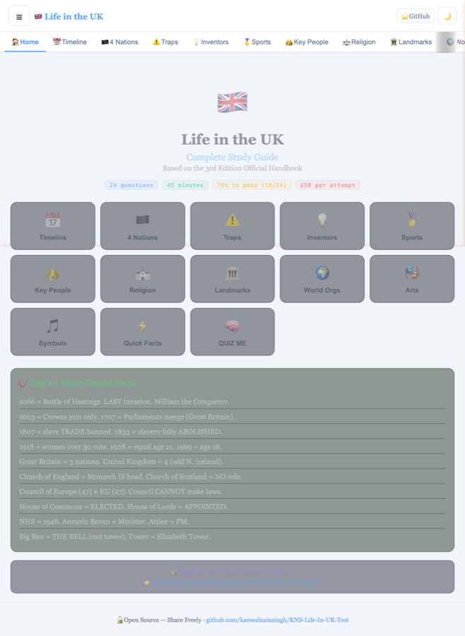

# Life in the UK Test Prep App

Mobile-first revision app for the UK citizenship test. It is built to help learners revise quickly, compare confusing facts, and practise under exam-style conditions without wading through long pages.

## What is in the app

- `Quick Revise` flash cards for left/right tap revision and fast fact recall
- `Quiz` practice with configurable answer reveal:
  - show answer instantly
  - show answer at the end
  - optionally include context and memory clues
- `Mock Test` mode for a more official-style run
- `Rapid Fire` for timed, high-randomness recall
- `Revise Mistakes` flow to revisit weak questions
- `Confusing Topics` side-by-side comparisons for facts people often mix up
- visual mnemonics and memory hooks such as `LECB`, `BSLH`, and `DRIM`
- grouped topic sections covering history, values, law, government, nations, landmarks, religion, sports, inventors, arts, symbols, and international organisations

## Why this app is different

The app is not just a fact list. It is designed around revision behaviour:

- short cards instead of dense text
- memory cues attached to facts and answers
- compare-first layouts for high-confusion topics
- mobile navigation that stays usable on long pages
- practice modes that reduce repeated questions across sessions

## Current coverage

The content is organised so the major official handbook areas are not skipped:

- values and principles of the UK
- what is the UK
- history of the UK
- modern British society
- government, law, and your role as a citizen
- geography, landmarks, symbols, religion, arts, sport, and notable people

Current validated quiz bank: `223` questions.

## Screenshots

Mobile view:

<p align="center">
  
</p>

<p align="center">
  
  &nbsp;
  
</p>
<p align="center">
  
  &nbsp;
  
</p>

## Main study modes

### Quick Revise

Use this for fast revision. Cards are designed for quick recall, flipping, and swipe-like study on mobile. It is the fastest way to cover broad content before a mock.

### Quiz

Use this for normal practice. You can choose whether to:

- see the answer immediately
- see the answer only at the end
- include memory/context tips

This is the best mode for learning and checking understanding at the same time.

### Mock Test

Use this for exam-style practice. It is intended to feel closer to the real test and works best with answer reveal at the end.

### Rapid Fire

Use this for pressure practice. It pulls from a broad question pool and avoids recent repeats so the mode stays useful over multiple sessions.

### Revise Mistakes

Use this after any quiz or mock. Wrong answers are saved so you can revisit weak areas instead of restarting everything.

## Mobile navigation

The app is designed to stay usable on a phone:

- the `Life in the UK` header takes you back home
- a header back action is available in study flows
- mobile bottom navigation keeps major modes close
- a quick panel gives access to grouped sections without long scrolling
- a floating `Top` button helps on long pages

## Topic map

The menu is grouped to make navigation simpler on both desktop and mobile.

### Study Modes

- Home
- Quick Revise
- Quiz
- Mock Test
- Rapid Fire
- Revise Mistakes

### Core Topics

- Timeline
- 4 Nations
- Confusing Topics
- Quick Facts
- Landmarks
- Government and law related facts

### People and Culture

- Key People
- Inventors
- Sports
- Religion and Festivals
- Arts
- Symbols
- International Organisations

## Run locally

This project has no build step.

```bash
python3 -m http.server 4173
```

Then open `http://localhost:4173`.

## Project structure

- [index.html](index.html) sets up the page shell and shared CSS
- [src/app.jsx](src/app.jsx) contains the React UI, state, mobile navigation, and study modes
- [src/data.js](src/data.js) contains all tabs, facts, mnemonics, and quiz questions
- [tests/smoke-check.js](tests/smoke-check.js) runs structural validation on content and UI hooks
- [tests/coverage-audit.js](tests/coverage-audit.js) checks where facts and questions may still be thin
- [AGENTS.md](AGENTS.md) records product intent and recent changes for future contributors and coding agents

## How to update content

Add or edit facts in [src/data.js](src/data.js). Keep new entries inside the existing topic groups where possible.

Quiz items use this structure:

```js
{ q: "Question?", opts: ["A", "B", "C", "D"], a: 1, tip: "Memory clue or context." }
```

Guidelines:

- keep questions short and exam-like
- use `tip` for memory hooks, comparisons, and traps
- prefer facts that are official-scope, high-frequency, or easy to confuse
- avoid near-duplicate questions unless the wording teaches a different distinction

## Testing

Run:

```bash
node tests/smoke-check.js
node tests/coverage-audit.js
```

The smoke check validates the current app shape. The coverage audit is a guide for finding thin areas, not a strict truth source.

## Source basis

The app is based on the official handbook for the Life in the UK Test. Supplementary notes and mnemonics are used only to improve recall, not to replace the official source.
