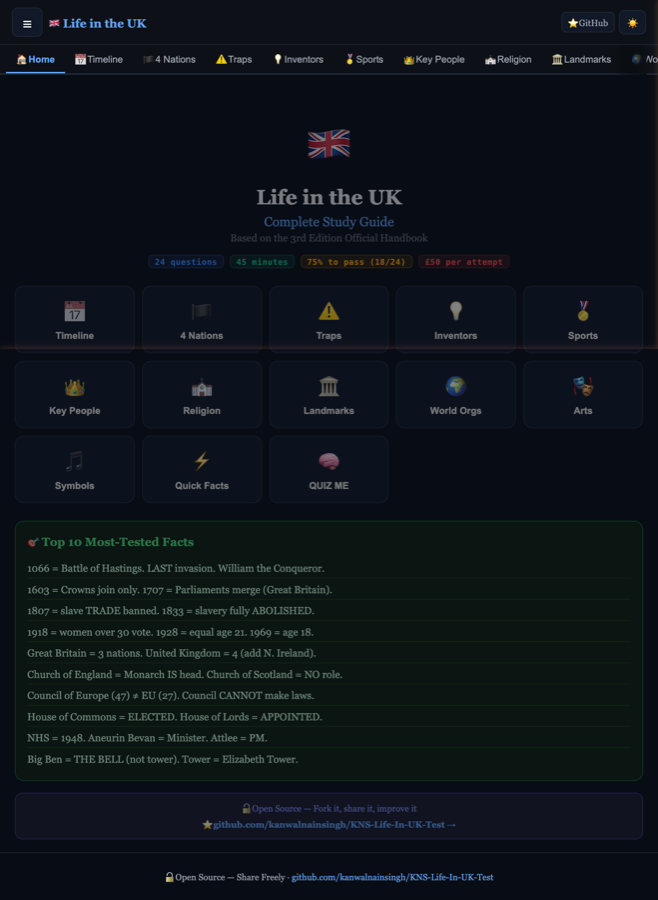
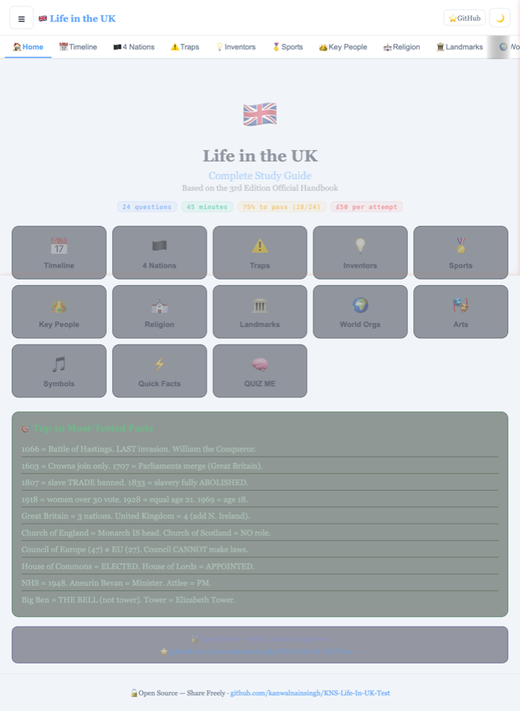
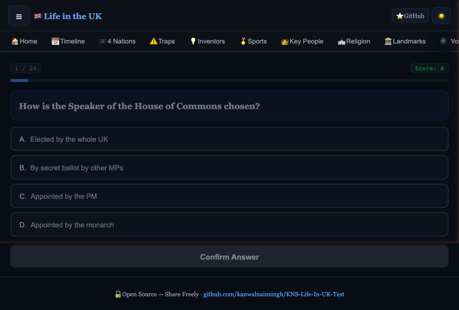

# 🇬🇧 Life in the UK — Complete Study Guide

A free, open-source study guide for the **Life in the UK citizenship test** (3rd Edition).

> 📖 100+ quiz questions · 💡 Memory hooks on every fact · 📅 Full timeline · ⚠️ Don't-confuse section

---

## 🌐 Live Site

[**→ Open the Study Guide**](https://kanwalnainsingh.github.io/KNS-Life-In-UK-Test/)

---

## 📸 Screenshots

<p align="center">
  
  &nbsp;
  
</p>
<p align="center">
  
  &nbsp;
  
</p>

---

## 📱 How to Use

1. **Open the app** at the live link above — works on any device, no install needed
2. **Browse sections** using the tab bar at the top, or tap ☰ to see all sections
3. **Toggle dark / light mode** with the ☀️ / 🌙 button in the header
4. **Study each section** — every fact has a 💡 Memory hook to help you remember, and a 🚨 Exam trap to warn about common mistakes
5. **Test yourself** with 🧠 QUIZ ME — choose 10, 24, 50 or all 100+ questions, review wrong answers at the end
6. **Try Rapid Fire** 🔥 — 10 questions, 20 seconds each, auto-advances when time runs out — simulates real exam pressure
7. **Star the repo** ⭐ if it helps you — and share it with others studying for the test

---

## ✨ Features

| Tab | What's in it |
|---|---|
| 🏠 Home | Test info, top 10 facts, quick jump links |
| 📅 Timeline | All events 10,000 BC → present, filterable by era |
| 🏴 4 Nations | England, Scotland, Wales, N. Ireland — saints, flags, parliaments |
| ⚠️ Traps | 8 most-confused topic pairs with side-by-side comparison |
| 💡 Inventors | 24 inventors with categories + memory hooks |
| 🏅 Sports | 22 athletes with achievements |
| 👑 Key People | 21 historical figures |
| ⛪ Religion | 2011 Census stats + 16 festivals |
| 🏛️ Landmarks | 20 places with exam traps |
| 🌍 World Orgs | Commonwealth, UN, NATO, Council of Europe |
| 🎭 Arts | Literature, Music, Art, Architecture, Fashion, Film |
| 🎵 Symbols | National anthem, Union Jack, population history |
| ⚡ Quick Facts | Government, Law, Everyday Life, Currency |
| 🧠 QUIZ ME | 100+ randomised questions with memory tips |
| 🔥 Rapid Fire | 10 questions · 20 sec each · auto-advance on timeout |

---

## ✏️ How to Maintain & Update Facts

The app is split into two files intentionally:

### To add or edit a fact → `src/data.js`

Each section is clearly labelled. For example, to add a timeline event:
```javascript
// In TIMELINE array, add:
{ year:"1945", era:"Modern", event:"Your new event here", icon:"🕊️", color:"#065f46",
  memory:"Memory hook to help remember this." },
```

To add a quiz question:
```javascript
// In ALL_QUIZ array, add:
{ q:"Your question?", opts:["Option A","Option B","Option C","Option D"], a:1,
  tip:"Memory tip shown after answering." },
// a: is the INDEX (0-3) of the correct answer
```

### To change the UI → `src/app.jsx`

Each tab has its own function (e.g., `TimelineTab`, `QuizTab`, `RapidFireTab`). Edit independently.

### All categories in `src/data.js`:
| Variable | Tab |
|---|---|
| `TIMELINE` | Timeline tab |
| `NATIONS` | 4 Nations tab |
| `CONFUSABLES` | Traps tab |
| `INVENTORS` | Inventors tab |
| `SPORTS_STARS` | Sports tab |
| `KEY_FIGURES` | Key People tab |
| `RELIGIONS` / `FESTIVALS` | Religion tab |
| `LANDMARKS` | Landmarks tab |
| `INT_ORGS` | World Orgs tab |
| `ARTS` | Arts tab |
| `QUICK_FACTS` | Quick Facts tab |
| `ALL_QUIZ` | Quiz + Rapid Fire tabs |
| `POPULATION_HISTORY` | Symbols tab |
| `ANTHEM` | Symbols tab |

---

## 📚 Source

All facts are based on **Life in the United Kingdom: A Guide for New Residents (3rd Edition)**, published by TSO. That is the only official source for the test.

---

## 🔓 License

Open source — share freely. Help others pass their test!

---

## 🤝 Contributing

Pull requests welcome! If you find an error or want to add more quiz questions:
1. Fork the repo
2. Edit `src/data.js`
3. Submit a pull request
